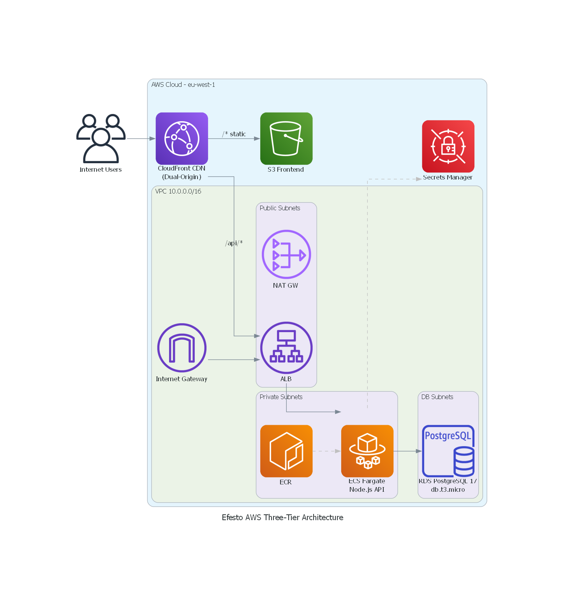

# AWS Three-Tier Demo — Task Manager

A full-stack demo application showcasing a three-tier architecture on AWS, built with Terraform.
Designed to be used as a **migration mockup from AWS to Azure**.

```
CloudFront (CDN)
     │
     ├── /* ──────────── S3 (static HTML/CSS/JS)
     │
     └── /api/* ─────── ALB ──► ECS Fargate (Node.js API)
                                       │
                                    RDS PostgreSQL
```

## Architecture Diagram



## Prerequisites

| Tool | Version | Install |
|------|---------|---------|
| Terraform | >= 1.5.0 | https://developer.hashicorp.com/terraform/install |
| AWS CLI | >= 2.x | https://aws.amazon.com/cli/ |
| Docker | >= 24.x | https://docs.docker.com/get-docker/ |
| Node.js | >= 18.x | https://nodejs.org/ |

AWS credentials must be configured for profile `lb-aws-admin`:
```bash
aws configure --profile lb-aws-admin
```

## Deployment — Step by Step

### 1. Initialize Terraform
```bash
cd terraform
cp terraform.tfvars.example terraform.tfvars
# Edit terraform.tfvars if needed
terraform init
terraform apply
```
This creates: VPC, subnets, security groups, RDS, ECR, ECS cluster, ALB, S3, CloudFront.

> **Note**: ECS service will initially fail to start because the container image doesn't exist yet. This is expected.

### 2. Build and Push the Backend Image
```powershell
.\scripts\build-and-push.ps1
```
This builds the Docker image, pushes it to ECR, and forces ECS to redeploy.

### 3. Deploy the Frontend
```powershell
.\scripts\deploy-frontend.ps1
```
This uploads the HTML/CSS/JS to S3 and invalidates the CloudFront cache.

### 4. Access the Application
```bash
terraform output frontend_url
```
Open the URL in your browser. The app should be live in ~2 minutes.

---

## Architecture Details

| Component | AWS Service | Notes |
|-----------|-------------|-------|
| Frontend | S3 + CloudFront | SPA served via CDN. `/api/*` routed to ALB |
| Backend API | ECS Fargate | Node.js Express REST API (port 3000) |
| Database | RDS PostgreSQL 15 | db.t3.micro, single-AZ (demo config) |
| Container Registry | ECR | Lifecycle policy: keep last 10 images |
| Secrets | Secrets Manager | DB password auto-generated via `random_password` |
| Load Balancer | ALB | HTTP only (demo). Health check on `/health` |
| Networking | VPC | Public + Private + DB subnets across 2 AZs |

## API Endpoints

| Method | Path | Description |
|--------|------|-------------|
| GET | `/api/tasks` | List all tasks |
| POST | `/api/tasks` | Create a task (`{ "title": "...", "description": "..." }`) |
| PUT | `/api/tasks/:id` | Update a task (`{ "completed": true }`) |
| DELETE | `/api/tasks/:id` | Delete a task |
| GET | `/health` | Health check (DB ping) |
| GET | `/api/info` | App info + environment |

## Terraform Outputs

| Output | Description |
|--------|-------------|
| `frontend_url` | CloudFront URL to access the app |
| `api_url` | ALB DNS name for the backend API |
| `ecr_repository_url` | ECR repo URL for Docker push |
| `s3_bucket_name` | Frontend static assets bucket |
| `cloudfront_distribution_id` | For cache invalidation |
| `ecs_cluster_name` | ECS cluster name |
| `ecs_service_name` | ECS service name |

## Teardown

```bash
cd terraform
terraform destroy
```

> Note: `skip_final_snapshot = true` and `deletion_protection = false` on RDS means it will be deleted immediately.

## Migration to Azure

See [migration-to-azure/README.md](migration-to-azure/README.md) for the full AWS → Azure mapping.

## Project Structure

```
aws-three-tier-demo/
├── app/
│   ├── backend/           # Node.js Express API
│   │   ├── src/index.js
│   │   ├── package.json
│   │   └── Dockerfile
│   └── frontend/          # Vanilla HTML/CSS/JS SPA
│       ├── index.html
│       ├── style.css
│       └── app.js
├── terraform/
│   ├── main.tf            # Root orchestrator
│   ├── variables.tf
│   ├── outputs.tf
│   ├── providers.tf
│   ├── terraform.tfvars.example
│   └── modules/
│       ├── vpc/
│       ├── security-groups/
│       ├── database/
│       ├── backend/       # ECR + ECS + ALB
│       └── frontend/      # S3 + CloudFront
├── scripts/
│   ├── build-and-push.ps1 # Docker build + ECR push + ECS redeploy
│   └── deploy-frontend.ps1 # S3 sync + CloudFront invalidation
├── migration-to-azure/
│   └── README.md          # AWS → Azure mapping guide
└── README.md
```
